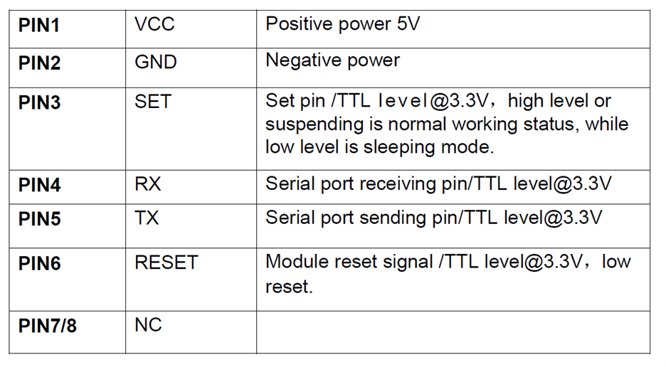
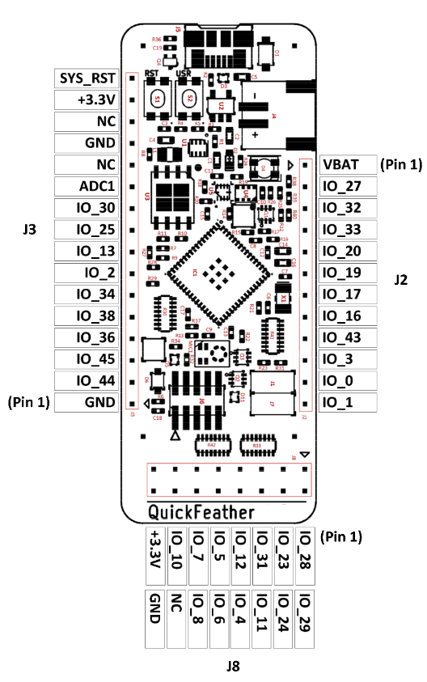
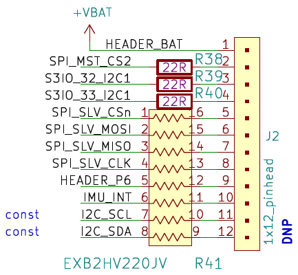
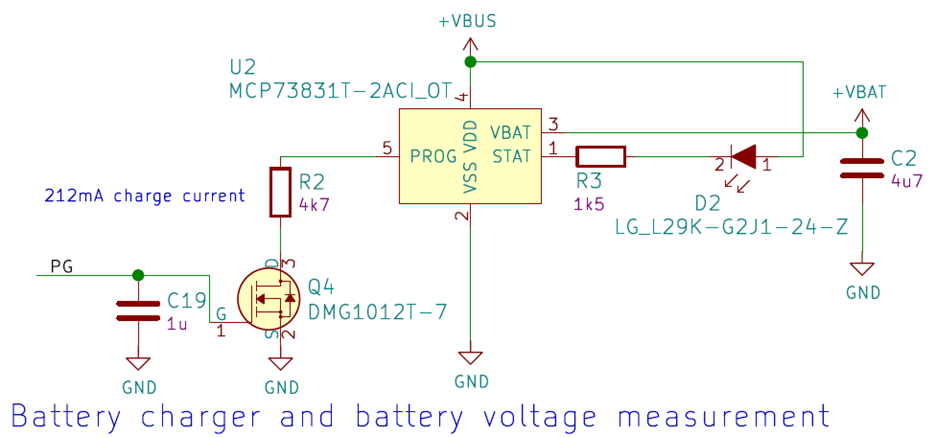
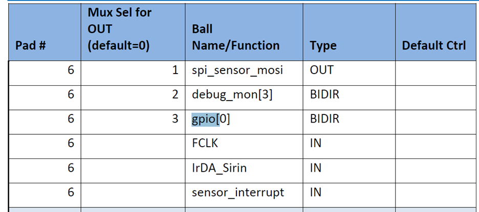
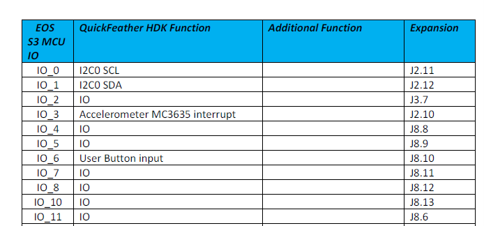
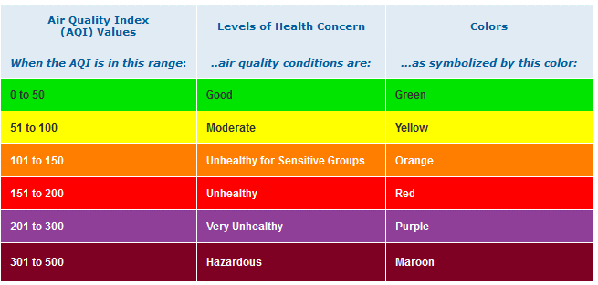
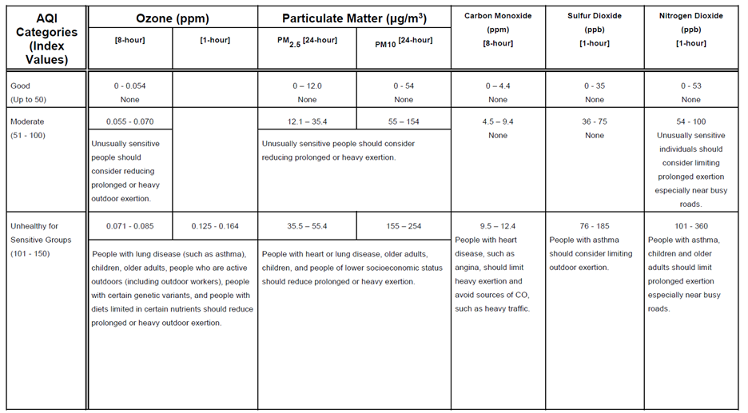
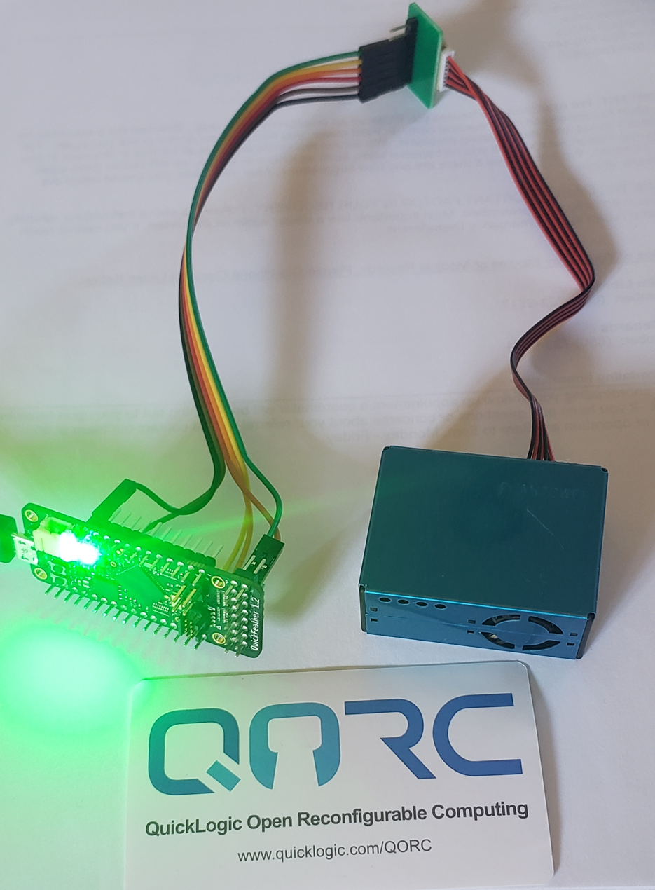

# Building the pm2dot5aqi app

## Purpose
With the fires raging in California, air quality is a concern.  So I thought that it would be fun to create a small app using QuickFeather to
monitor the local air quality.  This document captures the steps that I went through to create a device that monitors the PM2.5 level, and
uses the LED to indicate whether the level is considered, Good, Moderate or Unhealthy.

## Sensor connections
Adafruit has a nifty PM2.5 sensor:

 
The datasheet lets us know the device uses a UART interface with pinout:

While the datasheet indicates that we can leave SET and RESET unconnected, to get maximum flexibility we will connect them to GPIO so that we can control them.

## QuickFeather connections
Grabbing the QuickFeather User Guide we take a look at the board I/O diagram:

### GND
How to connect the GND is obvious (use J3.1, or J3.13, or J8.16).  

### VCC
The datasheet specifies that VCC must be 5V, not 3.3V – so how are we going to get that? Since the board is powered by USB, and the normal USB voltage is 5V, perhaps VBAT (J2.1) is 5V?  We can look at the schematic to find out.
Zooming in on J2 we find that J2.1 is connected to VBAT:

And VBAT is driven by the charger:

So, it is unlikely to be 5V, more likely to be 4.2V.  A quick measurement shows it to be 4.3V on my QuickFeather.  We’ll just have to see if that is good enough, otherwise we have the tricky task of finding VBUS on the board as soldering a wire to it.

### SET
We want to connect this to a GPIO so that it is under software control.  However, a search of the User Guide results in no matches. So, that means we need to go to the S3 documentation.  We could go to the datasheet, but the S3 TRM (Technical Reference Manual) has a lot more information, so let’s use that.

Where we learn that GPIO[0] shares IO_6 (pad 6) with several other signals.  
The table in pincfg.c is used to control which function drives the IO.  
Continuing the search, we can build the following table:
|GPIO | IO | IO |
| :---: | :---: | :---: |
| 0 | 6 | 24 |
| 1 | 9 | 26 |
|2	|11	|28|
|3	|14	|30|
|4	|18	|31|
|5	|21	|36|
|6	|22	|38|
|7	|23	|45|

Notice that each GPIO can drive two different pins.  The table in pincfg.c is used to select which of the two IOs is driven by the GPIO.
Now we need to understand which pins on the QuickFeather are driven by the GPIO and if there is and conflicting function. 
The QuickFeather User Guide has a useful table that helps with this:

From this we can see that GPIO0 can drive IO_6, which is connected to the User Button and J8.10. 
GPIO1 can drive IO_9, but the table is silent about IO_9 which presumably means that it has some other use. 
Filling out the complete table we get:
|GPIO	|IO	    |Function	    |Connector	|IO	    |Function	    |Connector  |
| :---: | :---: | ---           | :---:     | :---: | ---           | :---:     |
|0	    |6	    |User Button	|J8.10	    |24	    |I2S Slave DATA	|J8.4       |
|1	    |9	    |	            |	        |26	    |	            |           |
|2	    |11	    |IO	            |J8.6	    |28	    |PDM Data	    |J8.1       |
|3	    |14	    |SWD CLK	    |J6.4	    |30	    |IO	            |J3.10      |
|4	    |18	    |Blue LED	    |N/A	    |31	    |I2S Slave CLK	|J8.5       |
|5	    |21	    |Green LED	    |N/A	    |36	    |SPIM MISO	    |J3.4       |
|6	    |22	    |Red LED	    |N/A	    |38	    |SPIM MOSI	    |J3.5       |
|7	    |23	    |I2S Slave WCLK	|J8.3	    |45	    |UART RX	    |J3.3       |

We need GPIO4,5 and 6 to control the LED to indicate air quality, so those are not appropriate.
  
GPIO2 is shorted to PDM data so that is not available without modifying the board.

GPIO1 does not go to a connector.

That leaves GPIO0/IO_24 for the SET and GPIO7/IO_23 for the RESET.

So now we can create our wiring table:
|PMS5003 Pin|PMS5003 Function	|QuickFeather Connector	|QuickFeather Function|
| :---:     | :---:             | :---:                 | ---   |
|1	        |VCC	            |J2.1	                |VBAT   |
|2	        |GND	            |J3.13	                |GND    |
|3	        |SET	            |J8.4	                |GPIO0  |
|4	        |RX	                |J3.2	                |TX *   |
|5	        |TX	                |J3.3	                |RX     |
|6	        |RESET	            |J8.3	                |GPIO7  |

•	Note that you must be careful with RX and TX.  Does RX mean that this pin receives, or that it expects to drive a receiver?  
In other words, do you connect RX to RX, or RX to TX.

## Creating the program
Since this is a purely software app, a good starting point is qf_helloworldsw.  So, we copy that directory into a new directory called qf_pm2dot5aqi.

### Add
* pm2dot5monitortask.c

### Modify
If you want to see exactly what was changed and added in the code, compare this project to qf_helloworldsw.  The changed files are:
* Main.c
* Main_dbg_cli_menu.c
* Copy and modify qf_hardwaresetup.c
* Pincfg_table.c
* Fw_global_config.h

## Computing AQI
https://cfpub.epa.gov/airnow/index.cfm?action=aqibasics.aqi

Since these are normalized values, with 100 set as the acceptable limit, we need to know the mapping.  
For the US the curve is defined by the EPA and can be found at 
https://www.google.com/url?sa=t&rct=j&q=&esrc=s&source=web&cd=&ved=2ahUKEwjtzK3YpJrsAhUMvJ4KHaBfD8wQFjALegQIARAC&url=https%3A%2F%2Fwww.airnow.gov%2Fsites%2Fdefault%2Ffiles%2F2018-05%2Faqi-technical-assistance-document-may2016.pdf&usg=AOvVaw1_iX6rgxZBBNPTdzqIn_D3

The first part of the table is:

This is a piece-wise linear table, such that values from the range 0-12 are mapped onto the range 0-50, and those from the range 12 to 35.4 are mapped onto 50 to 100.
The condensed table is:
|PM2.5 ug/m^3	|AQI	|Meaning (if less than AQI)	|AQI Color	|LED Color  |
| :---:         | :---: |   ---                     | :---:     | :---:     |
|0	            |0      |                           |           |           |			
|12	            |50	    |Good	                    |Green	    |Green      |
|35.4	        |100	|Moderate	                |Yellow	    |Blue       |
|55.4	        |150	|Unhealthy for sensitive groups	|Orange	|Red        |
|150.4	        |200	|Unhealthy	                |Red	    |Purple     |
|250.4	        |300	|Very Unhealthy	            |Purple	    |Purple     |
|500.4	        |500	|Hazardous	                |Brown	    |Purple     |

## Finished product

Showing green, so my indoor AQI is Good.  When I take it outside, the color switches to blue indicating Moderate air quality.
So now I know that the natural filtering effect of the house, combined with a number of HEPA filters really helps.

